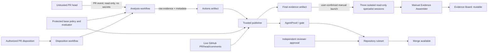

# Architecture

## Goal and trust statement

AgentProof evaluates a bounded statement for one repository, policy version,
and pull-request head SHA. Enforced human decisions and independent review
additionally require the target repository's verified GitHub protections.
The kit itself contains no application; only toolkit CI is active here.

It does **not** prove universal authorship, security, privacy, legal compliance,
or production fitness.

## Components

| Layer                    | Component                                                 | Responsibility                                                                                                                              |
| ------------------------ | --------------------------------------------------------- | ------------------------------------------------------------------------------------------------------------------------------------------- |
| Subject                  | Consuming application and PR                              | Untrusted code and declared origin under review.                                                                                            |
| Collection               | `@agentproof/evidence-cli` collectors                     | Run tests/coverage, dependency audit, retention validation, and origin parsing; normalize failures as findings.                             |
| Contract                 | `@agentproof/evidence-core`                               | Validate evidence and policy, canonicalize JSON, calculate digests, authorize dispositions, and compute the gate.                           |
| Analysis workflow        | `agentproof-analyze.yml`                                  | Use protected workflow bootstrap, read-only GitHub access, no secrets, and an ephemeral runner to create raw head-SHA evidence.             |
| Publisher                | `agentproof-publish.yml`                                  | Run trusted base code, validate provenance and live SHA, apply protected-base policy, publish the check/comment, and retain final evidence. |
| Disposition/revalidation | `agentproof-disposition.yml`, `agentproof-revalidate.yml` | Re-evaluate on decision changes and periodically so deleted or expired acceptance cannot leave a stale green result.                        |
| App reviewers            | Test, Security, Policy                                    | User starts three isolated, read-only sessions after the check; they return same-SHA advisory fragments and cannot write to GitHub.         |
| Assembler and canvas     | Evidence Assembler, Evidence Board                        | User runs assembly manually to reject mixed-SHA inputs and load a mutable operational view and decision draft.                              |
| Permission canary        | Disposable personal PR automation                         | Inspects the effective runtime tool boundary, stops before tool use on mutation capability, and is disabled after a failed validation.      |
| Governance               | GitHub ruleset, CODEOWNERS, independent review            | Require the stable check and a separate human approval before merge.                                                                        |

## Data flow

## Security-sensitive workflow split

1. **Analyze:** may execute PR-controlled application/test code, but receives no
   secrets and only read access. It cannot publish a check or comment.
2. **Publish:** has check/comment write capability, but executes trusted
   base/default-branch code only. It validates the incoming workflow,
   repository, PR, schema, artifact metadata, policy base SHA, and current head
   SHA before writing.
3. **Disposition:** never executes PR code. It authorizes the actor and command,
   invalidates the gate, and uses the shared exact-run controller rather than
   trusting a canvas draft.
4. **Revalidate:** uses the same controller per eligible open PR, with at most
   four concurrent PRs. The controller gets the native Analysis ID from the
   dispatch response, waits boundedly for that exact successful attempt,
   rechecks the subject, and explicitly dispatches trusted Publisher. It exits
   without waiting for Publisher, which needs the same per-PR gate lock.

Owner-origin Analysis completion still uses `workflow_run`. Controller-origin
bot Analysis is excluded from that ingress to avoid duplicate publication if
GitHub propagates its completion. Publisher's explicit ingress validates its
own native default-branch workflow/run identity and the exact Analysis
ID/attempt; it does not construct a synthetic completion event. No Analysis
write capability or additional credential is introduced. Failed refresh remains
blocking; live comment, periodic and expiry behavior must be verified after
human-controlled protected-base deployment.

Reviewer sessions are outside this write-capable workflow path. A user starts
each installed agent or reviewed deep link only after the deterministic result
exists, confirms a read-only tool set, and later invokes the assembler manually.
If the App cannot safely reduce an **All tools** default, the launch is canceled.

Historical trials found that a narrowed tool picker could still leave mutation,
shell, and cross-repository capabilities in the effective runtime. This is a
limitation, not evidence of a currently safe reviewer. The permission canary
must fail closed before tool use on such capabilities; it is not connected to
the deterministic gate.

The workflows use concurrency controls so an obsolete analysis cannot
intentionally overwrite a newer revision. GitHub Actions artifacts have finite
retention and are evidence records, not permanent archives.

## Authority and consistency

- Repository, PR number, base SHA, head SHA, policy digest, collector identity,
  and artifact digest must agree.
- A head-SHA change invalidates previous evidence and dispositions.
- Specialist prose is advisory. A collector failure becomes `unknown`.
- The Evidence Board can be edited or cleared and is never authoritative.
- GitHub commits, checks, native PR comments/reviews, and SHA-bound artifacts
  are the system of record.

## Deployment boundary

The deployable workflows live in `templates/github-workflows/`. Copy them to
the consuming repository's `.github/workflows/` only after reviewing its
integration, permissions, and policy. Shared scripts expect those installed
filenames. The application path is a protected shared setting, not PR input.

The integration scope is one GitHub.com repository, initially with synthetic
data. Installed Actions workflows are PR-triggered; the three reviewer sessions
and Evidence Assembler are manual.
Checked-in automation prompts are blocked setup/product-feedback templates, not
live personal reviewer automations or automation-as-code. Cross-repository
portfolio orchestration, automatic merge/release, and a locked audit store are
out of scope.

Historical check publication, plugin installation, or automation dispatch does
not validate another target. Record actual integration results using
[GitHub setup](github-setup.md). Missing private-repository ruleset entitlement
and unavailable independent human reviewers are explicit rollout blockers.
Toolkit-only protection uses `.github/rulesets/agentproof-toolkit.json` and
requires CI plus independent review, not the application gate. Consuming
applications use `.github/rulesets/agentproof.json`, which requires both checks.
