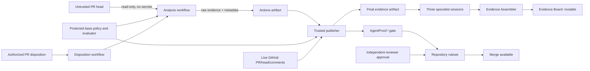

# Architecture

## Goal and trust statement

AgentProof proves a bounded statement: for one repository, policy version, and
pull-request head SHA, configured deterministic evidence was evaluated and an
explicit human decision plus independent review governed merge.

It does **not** prove universal authorship, security, privacy, legal compliance,
or production fitness.

## Components

| Layer                    | Component                                                 | Responsibility                                                                                                                              |
| ------------------------ | --------------------------------------------------------- | ------------------------------------------------------------------------------------------------------------------------------------------- |
| Subject                  | Synthetic expense API and PR                              | Untrusted code and declared origin under review.                                                                                            |
| Collection               | `@agentproof/evidence-cli` collectors                     | Run tests/coverage, dependency audit, retention validation, and origin parsing; normalize failures as findings.                             |
| Contract                 | `@agentproof/evidence-core`                               | Validate evidence and policy, canonicalize JSON, calculate digests, authorize dispositions, and compute the gate.                           |
| Analysis workflow        | `agentproof-analyze.yml`                                  | Use protected workflow bootstrap, read-only GitHub access, no secrets, and an ephemeral runner to create raw head-SHA evidence.             |
| Publisher                | `agentproof-publish.yml`                                  | Run trusted base code, validate provenance and live SHA, apply protected-base policy, publish the check/comment, and retain final evidence. |
| Disposition/revalidation | `agentproof-disposition.yml`, `agentproof-revalidate.yml` | Re-evaluate on decision changes and periodically so deleted or expired acceptance cannot leave a stale green result.                        |
| App reviewers            | Test, Security, Policy                                    | Read same-SHA facts and return advisory fragments; the bounded automation publisher may update one marker-delimited PR note.                |
| Assembler and canvas     | Evidence Assembler, Evidence Board                        | Reject mixed-SHA inputs and provide a mutable operational view and decision draft.                                                          |
| Governance               | GitHub ruleset, CODEOWNERS, independent review            | Require the stable check and a separate human approval before merge.                                                                        |

## Data flow

## Security-sensitive workflow split

1. **Analyze:** may execute PR-controlled application/test code, but receives no
   secrets and only read access. It cannot publish a check or comment.
2. **Publish:** has check/comment write capability, but executes trusted
   base/default-branch code only. It validates the incoming workflow,
   repository, PR, schema, artifact metadata, policy base SHA, and current head
   SHA before writing.
3. **Disposition:** never executes PR code. It authorizes the actor and command,
   then dispatches a fresh analysis rather than trusting a canvas draft.
4. **Revalidate:** periodically dispatches fresh evidence for open PRs so
   expiry/deletion cannot preserve an obsolete decision indefinitely.

The workflows use concurrency controls so an obsolete analysis cannot
intentionally overwrite a newer revision. GitHub Actions artifacts have finite
retention and are evidence records, not permanent archives.

## Authority and consistency

- Repository, PR number, base SHA, head SHA, policy digest, collector identity,
  and artifact digest must agree.
- A head-SHA change invalidates previous evidence and dispositions.
- Specialist prose is advisory. A collector failure becomes `unknown`.
- The Evidence Board can be edited or cleared and is never authoritative.
- GitHub commits, checks, native PR comments/reviews, and SHA-bound artifacts
  are the system of record.

## Deployment boundary

The MVP is one private GitHub.com repository with synthetic data. Cloud
automations are personal and single-repository scoped. Cross-repository
portfolio orchestration, automatic merge/release, and a locked audit store are
out of scope.
